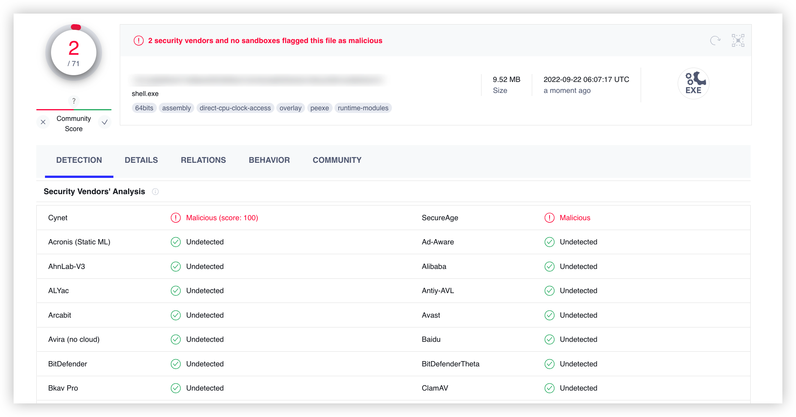
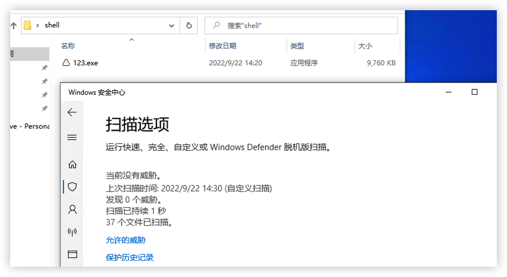
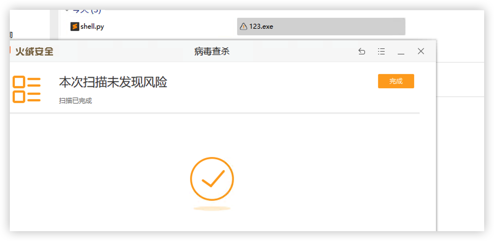
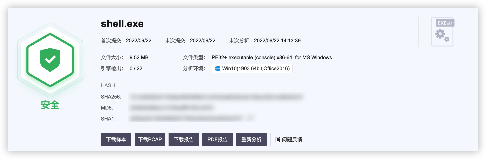

# 前言

- 本工具仅面向合法授权的企业安全建设行为与个人学习行为，如您需要测试本工具的可用性，请自行搭建靶机环境。

- 在使用本工具时，您应确保该行为符合当地的法律法规，并且已经取得了足够的授权。请勿对非授权目标上传使用。

如果发现上述禁止行为，我将保留追究您法律责任的权利。

如您在使用本工具的过程中存在任何非法行为，您需自行承担相应后果，我将不承担任何法律及连带责任。

在使用本工具前，请您务必审慎阅读、充分理解各条款内容。

除非您已充分阅读、完全理解并接受本协议所有条款，否则，请您不要安装并使用本工具。您的使用行为或者您以其他任何明示或者默示方式表示接受本协议的，即视为您已阅读并同意本协议的约束。

# pybypass

非常简单，没有啥技术含量的bypass，转去go之前完成了最后一个（可能）的python项目。早几年就有的python免杀了，自己随便改改加了点混淆，没想到效果意外的不错，`2022.9.22`测试能够过火绒、360、defender，VT 2/70（使用pyinstaller打包的必定会有查杀，无法避免），而且打包后文件太大了，不好用

- 优点：支持自定义混淆，使用方便
- 缺点：通过pyinstaller打包后的可执行文件特别大

### 使用方法：

1、首先通过`cs`或者`msf`生成`python`的`shellcode`，将`buf`变量内容放到`genShellCode.py`中，直接运行`genShellCode.py`生成分离的`shellcode`，默认文件名`README`，分离的`shellcode`同样能过bypass各种杀软。

2、修改`genLoader.py`中的内容，之后直接运行得到加载器`loader.py`

3、如果目标机器上没有python环境，需要用pyinstaller进行打包，打包后的文件大小在9M左右，将exe和README同时上传，运行exe即可。如果没有检测到README，直接退出不进行加载操作

##### 图一乐也就图一乐，真要图一乐还得图一乐
